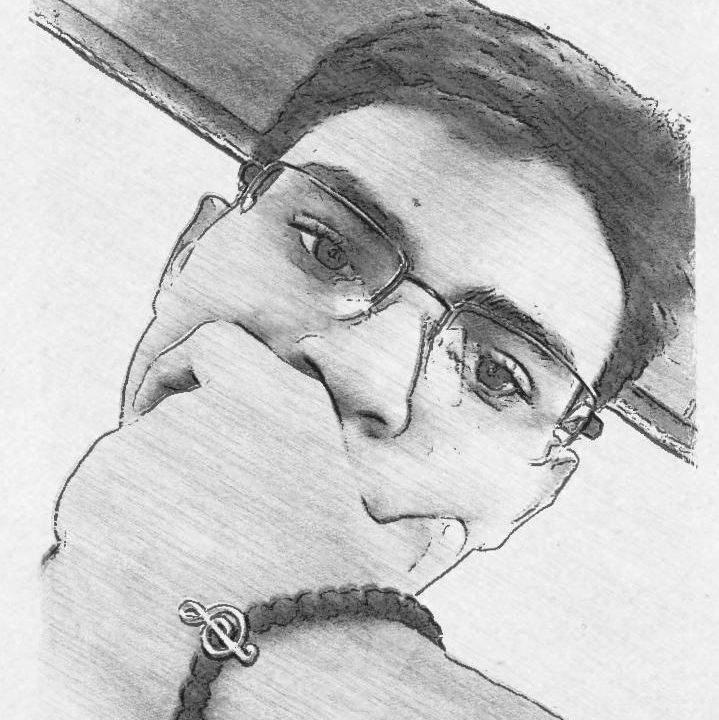

<!-- Apresentação -->

<div>

</div>


### I've been working as a developer for 2 years
### I'm 17 years old

<!-- BAdges -->

#
## Medias

[](https://www.behance.net/allanz1)

<!-- readme stats -->

### main.py
```python
import allanz

if allanz.coffee == False:
    allanz.tomarCafe()
else:
    allanz.trabalhar
```

<!-- Tecno day -->

#
## Technologies I use

<div>


</div>

<!-- qualquer coisa -->
#
#### The muse of my inspiration is technology, because every day it innovates and becomes more beautiful. I will never tire of her, she is so beautiful.
<!--
**All4nBK/All4nBK** is a ✨ _special_ ✨ repository because its `README.md` (this file) appears on your GitHub profile.

Here are some ideas to get you started:

- 🔭 I’m currently working on ...
- 🌱 I’m currently learning ...
- 👯 I’m looking to collaborate on ...
- 🤔 I’m looking for help with ...
- 💬 Ask me about ...
- 📫 How to reach me: ...
- 😄 Pronouns: ...
- ⚡ Fun fact: ...
-->
